# Global estimate of Riverine Methane Flux

Ongoing project trying to quantify CH4 emissions from rivers globally and monthly.

## Setup

Currently the datasets are private in a google drive, so you need access to run the code in this repository. Code is in the `code/` folder. A summary of the code chunks is as follows. Each script is self-enclosed so welcome to jump in at any of them.

-   Script 1 downloads the hydrology layers and gets the IDs for the methane sites.
-   Script 2 obtains some new attributes: land cover, groundwater table depth and nutrient fluxes.
-   Script 3 combines all attributes into two files, one for the modelling with only the sites with CH4 concentrations and another with the 2 million catchments for upscaling.
-   Script 4 is the random forest modelling to predict CH4 concentrations globally.
-   Script 5 is to extract seasonal hydrological parameters and estimate k.
-   Script 6 is to calculate fluxes for all GRADES reaches and extrapolate to smaller streams.
-   Script 7 is to do some maps and figures.

## Modelling

### Pre-processing

The predictors selected are shown below. Several have been removed due to high correlation among other ones (e.g. GPP and NPP, heterotrophic soil respiration and total soil respiration, several soil properties...)

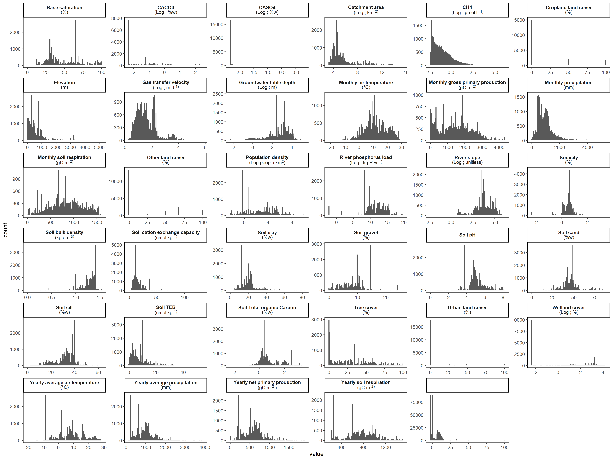

### Model performance

I did some grid-tuning to find the optimal hyperparameters for the random forest model, ending up with `mtry = 10, trees = 1200, min_n = 21`. I also tried running a model with the whole dataset, or an independent RF model for each month.

The random forest model seems to do OK, with an average R2= 0.5.

One problem I find is that monthly models are often very different among them, given that the number of sites changes a lot month to month as well as the spatial coverage. Thus it not only captures seasonal changes but also the (changing) geographical coverage of the data. One solution to maintain spatial coherence as well as the seasonality is for each month, feed the data of the given month and the adjacent months (e.g. for march use the data form february, march and april). This makes the model more homogeneous and robust, as well as an increase in predictive power.

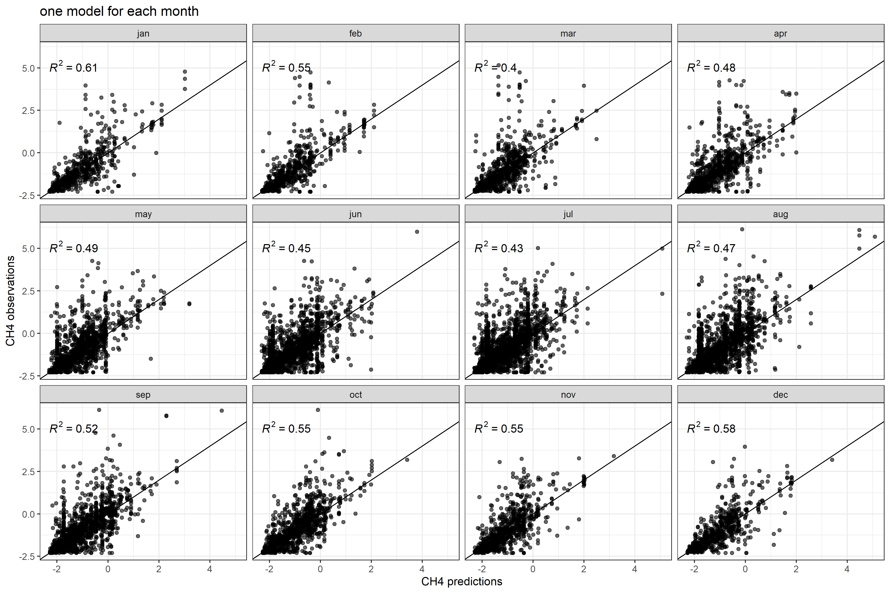

We can also look at the importance of the model variables. Here I show the average (+- SE) from all the 12 models used.

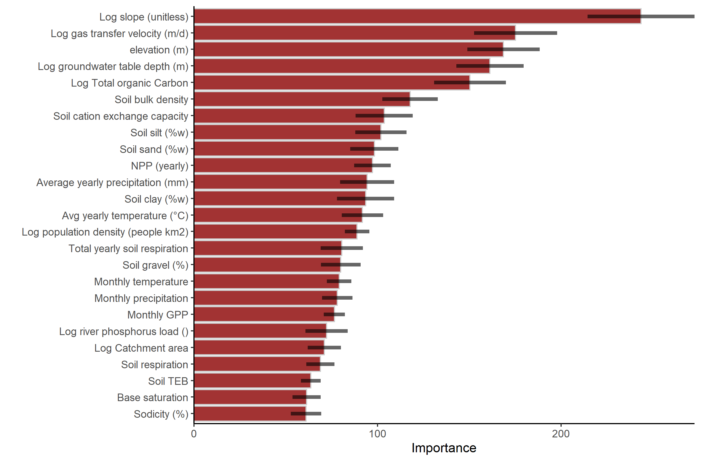

Another way to look at the role of each model is at partial dependence plots of each variable. Which shows the marginal response independently. it does not take into account potential interactions though. Plots sroted from most important variable (top-left) to least (bottom-roght)

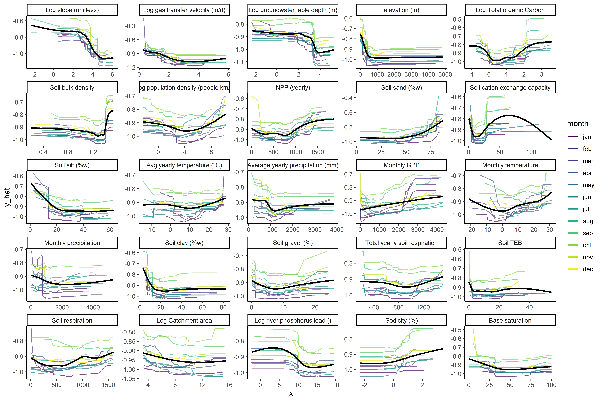

## Upscaling

To get a global flux number I still need to double check the scripts, so a bit later on that.

GRiMeDB has several thousand measured fluxes, so we can take advantage of this data to validate the predicted fluxes. I do this by matching predicted flux values to the corresponding flux observation for a given month.

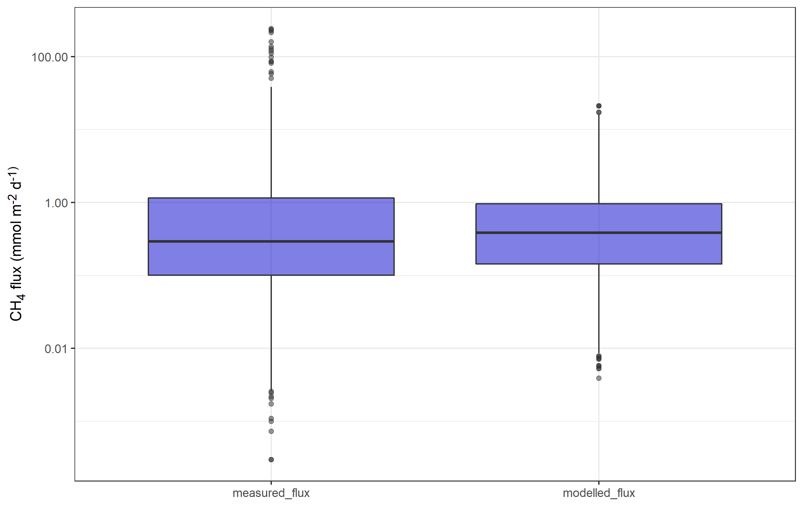

I can also back-calculate k from observations by dividing flux (mmol m-2d-1) with the associated concentration (mmol m-3, which gives me a kCH4 in m d-1. This might help to see where the noise comes from.

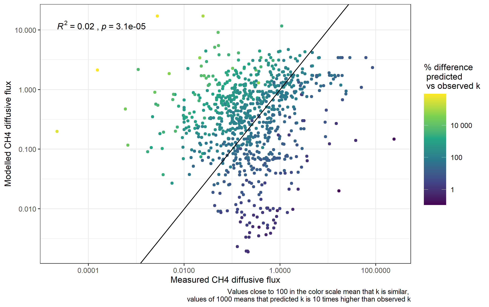

Things are on the same ballpark, which is a good start. Color shows how different predicted k values are. It seems like the values more off from the 1:1 line are sites with k differing a lot. A couple things to take into account here:

-   Modelled k is estimated from estimated slope and long-term averaged monthly modelled discharge, for a several kilometres river reach, using a hydraulic equation.

-   Measured k contains a mix of k estimates, most often derived from chambers, some slug gas releases, some from (multiple) hydraulic equations. So a wild mix here, and in the case of the chamber estimates is a quite local k estimate compared to a reach estimate. Ah, and it also flux dependent so it may be overestimated due to ebullition.

So this is a bit of an apples with oranges thing here. If we restrict the comparison of modelled vs predicted fluxes to sites with similar k (+/- 50%), things actually look quite neat.

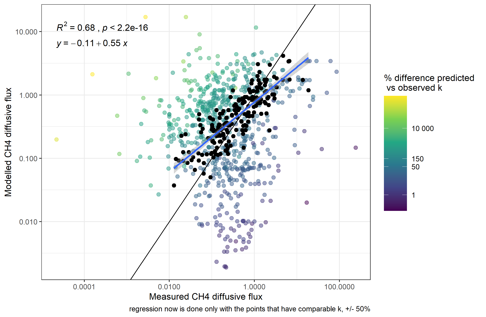

### Ebullition?

Including ebullition is the next thing. One option is to do a rough estimate based on diffusive fluxes, as in the observations in GRIME we have an OK relationship, as well as other literature.

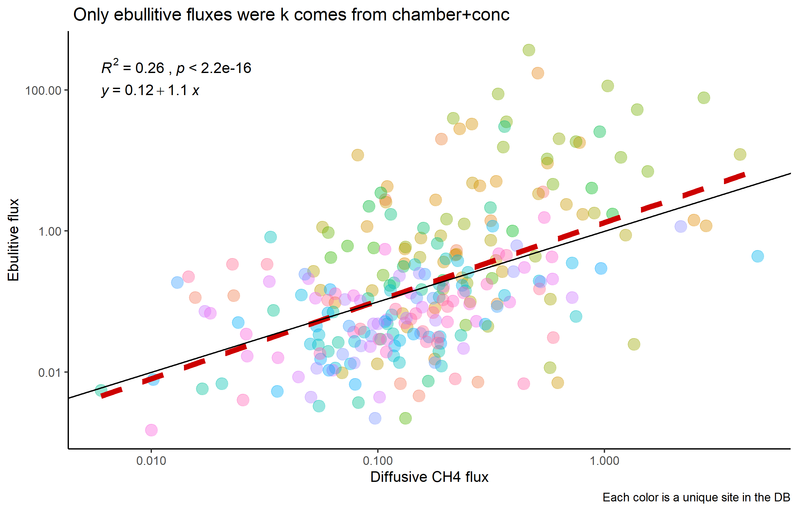

## Problems?

### Spatial and temporal data aggregation

One thing to think about is how data is included in the model. On one hand, GrRiMeDB has thousands of sites with one observation but also a handful of sites (Site_Nid) with dozens of observations (over multiple years in some cases. In the other hand the modelling is done using GRADES, whose sites (COMID) are a bit coarser spatially and at a monthly scale.

This means that some sites have a larger influence in the model. For example, at my backyard we have the Krycklan Catchment Study, with \~15 sites with monthly data for \~10 years, and a spatial survey with more than 100 sites. In the image below all sites are in red and in blue the nearest GRADES reaches.

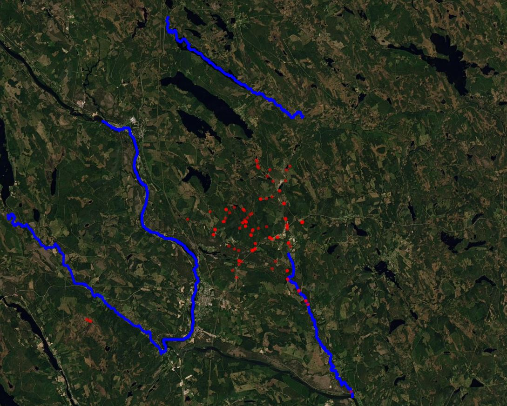

You see that the GRADES network reaches the main stem of the network, but most of the sites are snapped to the catchment outlet. This means that for this GRADES reach we have more than 100 sites and more than 1000 observations. Some of those sites are draining contrasting catchments with distinct methane dynamics (See Gomez-Gener, Hotchkiss, Laudon and Sponseller 2021 WRR), and it all gets lumped into one reach with homogeneous characteristics. Here is a summary of CH4 concentrations for all those sites.

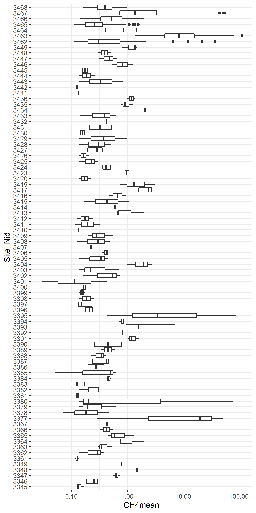

This affects the model in two ways. On one side it overfits because same sites are likely to be both in the training and test datasets. On the other side the model will struggle to perform well as concentrations range three orders of magnitude but the predictors are more or less constant.

A solution here would be to aggregate data by a GRADES reach and month, another solution is to throw away sites that are snapped more than x m.

#### Update on this

Ok good news, running the model with data aggregated by GRADES reach and month performs equally well 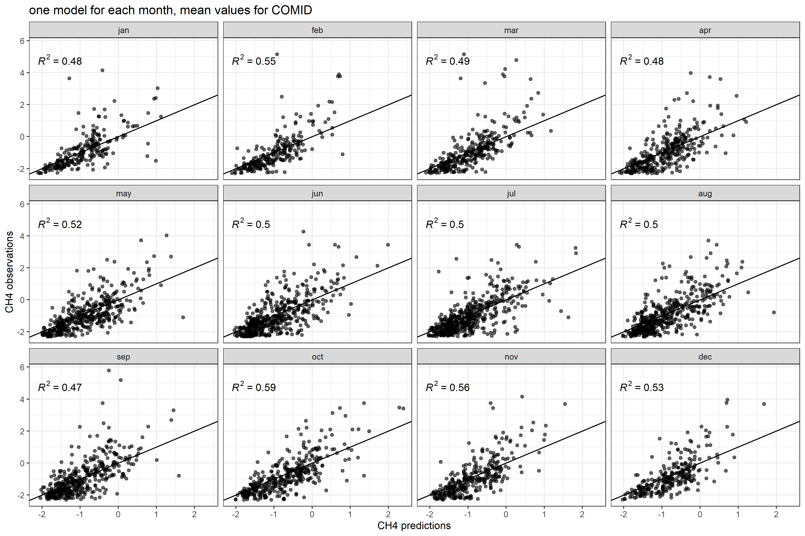

### k, my little obsession

So I included k in the model, and arises as an important predictor of CH4 concentrations. A good check is to look at how modelled k relates to modelled CH4.

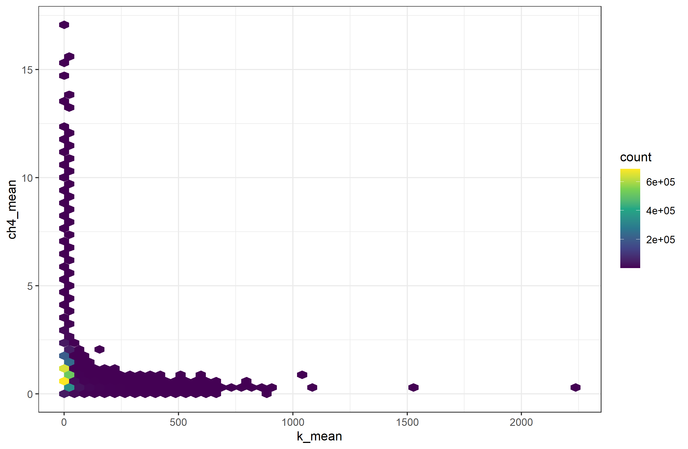

So far so good. That's what it should be. The problem however is that k ranges up to 2000 m d^-1. I am not saying that such high k are impossible, but the marginal effect on the flux should be negligible. In other words, CH4 is still predicted to be above saturation, but the CH4 flux at 50 vs 2000 m d^-1 should be relatively similar and not 40 times higher.

This is more apparent when we look at k vs flux, and we see that higher fluxes are at higher k. Black points and read smooth line show real measured fluxes

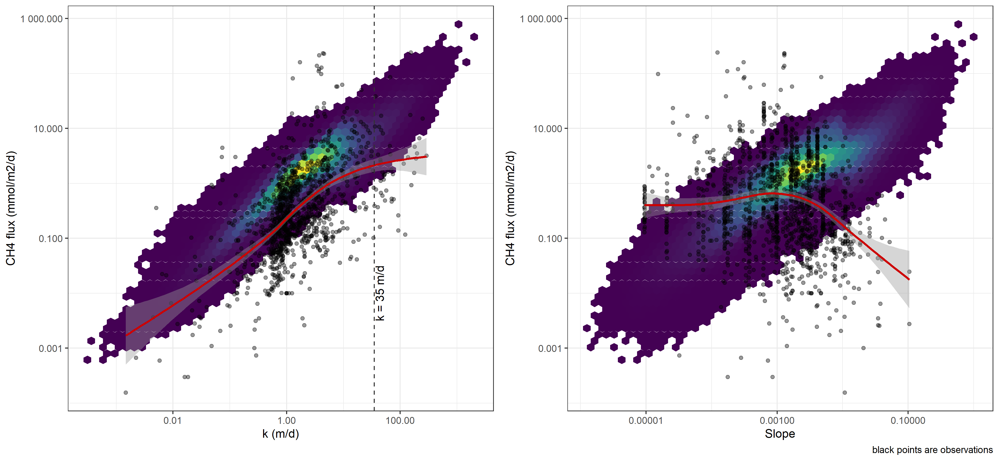

This has implications in the spatial patterns of methane, as in the map of concentrations mountain areas have low concentrations (as expected), but are instead hotspots of emissions.

A similar pattern is observed with concentrations

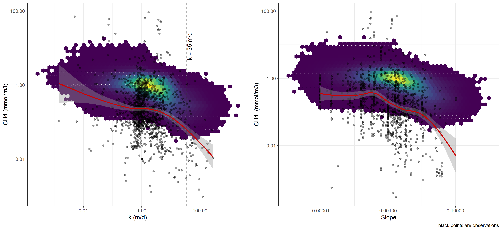

The vertical dashed line shows a k of 35 m/d, which is the maximum theoretical diffusive rate (Ulseth et al. 2018). Above that bubble mediated flux plays a big role. We do account for that when estimating k, but the effect of that on predicting concentrations should be more pronounced. Thus we results with a relatively high concentrations at high k, with unrealistically high fluxes. I tried capping k at 50 to start with, but it still shows the highest fluxes at the highest k, which is not really the case for the observations
