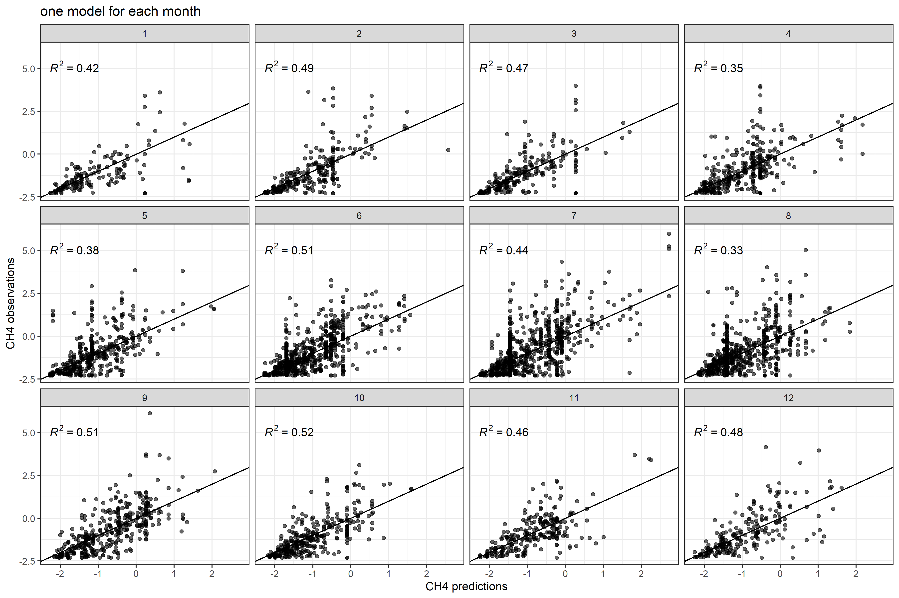
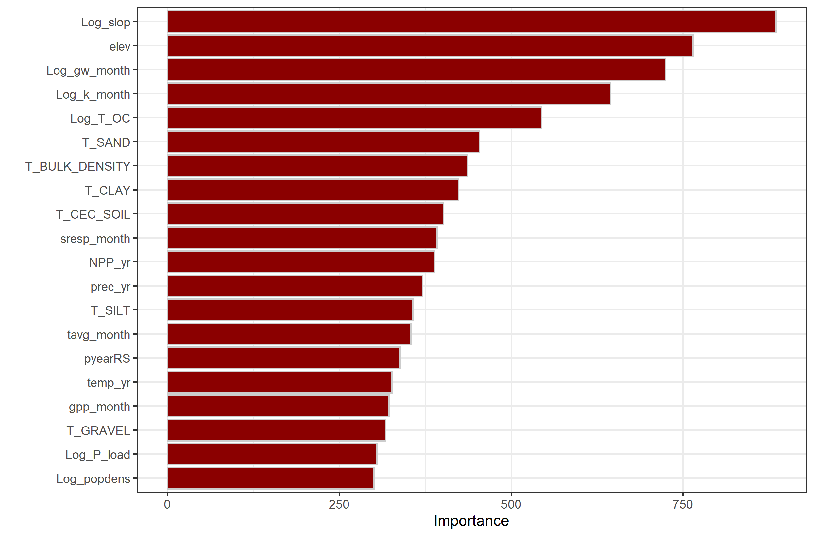

# Global estimate of Riverine Methane Flux

Ongoing project trying to quantify CH4 emissions from rivers globally and monthly. 

## Setup
Currently the datasets are private in a google drive, so you need access to run the code in this repository. 
Code is in the `code/` folder. A summary of the code chunks is as follows. Each script is self-enclosed so welcome to jump in at any of them.

 - Script 1 downloads the hydrology layers and gets the IDs for the methane sites.
 - Script 2 obtains some new attributes such as land cover and groundwater table depth.
 - Script 3 combines all attributes into two files, one for the modelling with only the sites with CH4 concentrations and another with the 2 million catchments for upscaling.
 - Script 4 is the random forest modelling to predict CH4 concentrations.
 - Script 5 is to upscale CH4 concentrations globally and calculate fluxes.

## Modelling
### Pre-processing
The predictors selected are shown below. Several have been removed due to high correlation among other ones (e.g. GPP and NPP, heterotrophic soil respiration and total soil respiration, several soil properties...)

### Model performance
I did some grid-tuning to find the optimal hyperparameters for the random forest model, ending up with 
`mtry = 20, trees = 1000, min_n = 25`. I also run a model with the whole dataset, or an independent model for each month.

The random forest model seems to do OK, with an average $R^{2}= 0.5$. Next figure shows an independent model run for each month.

One problem I find is that monthly models are often very different among them, given that the number of sites changes a lot as well as the spatial coverage. Thus it not only captures seasonal changes but also the geographical coverage of the data. One solution to maintain spatial coherence as well as the seasonality is for each month, feed the data of the given month and the adjacent months (e.g. for march use the data form february, march and april). This makes the model more homogeneous and robust, as well as subtantial increase in predictive power. 

We can also look at the importance of the model variables.

## Upscaling

## Problems?

